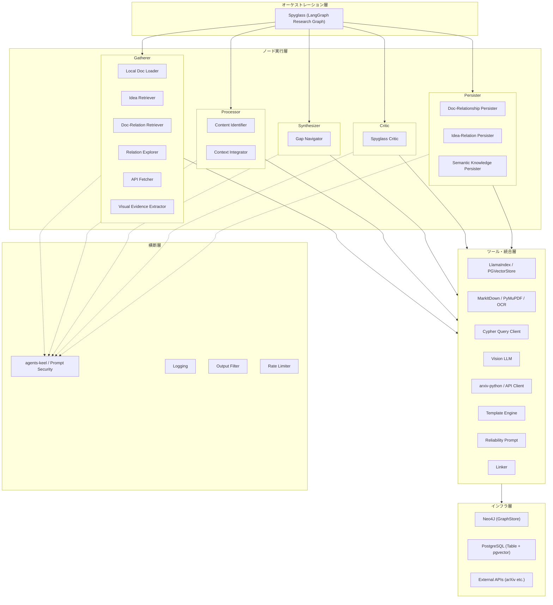

# Overview
- 本プロジェクトにおけるアーキテクチャはsrc構造を元にしFastAPIを土台として構成する
- レイヤーは上から順に、オーケストレーション層 → ノード実行層 → ツール・統合層 → インフラ層で構成する
- セキュリティ、LLM Factory、ロギング、出力フィルタなどは横断関心として各層から利用する

# Layer
origin_spyglassのレイヤー構成


## Node定義

| Node 分類               | Node 名                           | 責務と役割                                                   | 主要ツール                      |
| :-------------------- | :------------------------------- | :------------------------------------------------------ | :------------------------- |
| **Gatherer (Local)**  | **Local Doc Loader**             | ローカルの PDF/MD/JSON/HTML をパースしテキスト化。形式別の前処理（OCR等）を行う。     | MarkItDown / PyMuPDF       |
| **Gatherer (graph)** | **Idea Relation Retriever**           | Neo4jからテーマに関連する概念(idea)を検索・取得する。 | LlamaIndex / Neo4j |
| **Gatherer (graph)** | **Doc-Relation Retriever**           | Neo4jから文書間の引用関係や共起関係を検索・取得する。 | LlamaIndex / Neo4j |
| **Gatherer (Graph)**  | **Relation Explorer**            | Neo4J から引用関係、共起概念、著者ネットワークを取得する。                        | Cypher Query / Neo4J       |
| **Gatherer (Online)** | **API Fetcher**                  | arXiv 等の外部 API から最新の論文メタデータやアブストラクトを収集する。               | arxiv-python / API         |
| **Gatherer (Vision)** | **Visual Evidence Extractor**    | 論文内の図表、グラフ、実験画像から情報を抽出。画像内のテキストや数値を構造化データに変換する。         | Vision LLM (GPT-4o/Claude) |
| **Processor (ID)**    | **Content Identifier**           | 取得情報の種類（理論・手法・事実）を識別し、文脈に応じたタグ付けを行う。                    | LLM によるタグ付け                |
| **Processor (Merge)** | **Context Integrator**           | ソース別の情報を単一の「調査報告（統合 Markdown）」として一貫性を持って再構成する。          | テンプレートエンジン / LLM           |
| **Synthesizer**       | **Gap Navigator**                | 統合された知識を俯瞰し、未解決問題（ギャップ）を特定。その解決の難易度と意義を評価する。            | Neo4J自然言語探索                |
| **Critic**            | **Spyglass Critic**              | 調査の網羅性、エビデンスの信頼性、ギャップ特定の妥当性を検証。情報の不備やバイアスを指摘する。         | 信頼性評価プロンプト                 |
| **Persister (Doc)**   | **Doc-Relationship Persister**   | 読み込まれた各文書を保存。既存のナレッジネットワークとセマンティックに紐付け、リンクを生成する。        | Postgres / Linker          |
| **Persister (Rel)**   | **Idea-Relation Persister**      | 文献調査で得られた引用関係や、抽出された概念、それらの関連性をナレッジグラフ（Neo4j）に記録する。     | Neo4J                      |
| **Persister (Res)**   | **Semantic Knowledge Persister** | 調査報告とギャップを保存。過去のギャップリストと結びつけ、未解決問題の履歴を更新する。             | Postgres / Neo4J           |

## Persister 詳細

3つの Persister は「何を」「どのストアに」保存するかで役割が分かれる。それぞれが異なる粒度のオブジェクトを担当し、保存後に相互参照できる ID を介して結びつく。

### Doc-Relationship Persister（文書と紐付け）

> 保存対象: **文書エンティティ** そのもの

- **Local Doc Loader** が読み込んだ PDF/MD/HTML 等の原文をメタデータ（タイトル・著者・日付・ソースパス）とともに Postgres に保存する。
- 保存後、同じ内容をベクトル化して pgvector にインデックス登録し、**Semantic Retriever** が将来の検索で利用できる状態にする（Linker が担当）。
- ここで払い出された `doc_id` は、**Idea-Relation Persister** と **Semantic Knowledge Persister** が参照する共通キーになる。

### Idea-Relation Persister（概念・関係の記録）

> 保存対象: **概念ノード** と **エッジ（関係）**

- **Relation Explorer** や **Content Identifier** が抽出した「引用関係」「共起概念」「著者ネットワーク」を Neo4j にグラフ構造として書き込む。
- ノードには `doc_id`（→ Doc-Relationship Persister が発行）を属性として持たせ、グラフから元文書を逆引きできるようにする。
- **Semantic Retriever** が Neo4j 側を検索する際の索引を維持する責務も持つ。

### Semantic Knowledge Persister（調査結果の蓄積）

> 保存対象: **調査報告** と **ギャップ履歴**

- **Context Integrator** が生成した統合 Markdown（調査報告）と、**Gap Navigator** が特定したギャップリストを Postgres に保存する。
- 過去のギャップレコードと突合し、既存ギャップの解決状況を更新する（ステータス管理）。
- Neo4j にはギャップと関連概念ノード（→ Idea-Relation Persister が登録）を結ぶエッジを追記し、「どの概念群がどのギャップに関連するか」をグラフで辿れるようにする。

### 3者の依存関係

```
Doc-Relationship Persister
  └─ doc_id を払い出す
        │
        ├─▶ Idea-Relation Persister（概念ノードの属性として参照）
        │
        └─▶ Semantic Knowledge Persister（調査報告の出典として参照）
                │
                └─▶ Idea-Relation Persister（ギャップ↔概念エッジを追記）
```

> **補足**: Doc-Relationship Persister が先に実行されていないと `doc_id` が存在せず、他の2つが整合性を保てない。Orchestration 層（Spyglass）は Persister を呼ぶ順序を Doc → Rel → Res の順に固定する。

## Utilsの役割
- LLM接続(OpenAI API形式)
- ロギング
- 各プロンプトのセキュリティ担保
    - factory関数として定義することで疎結合を実現
    - LangGraph/LlamaIndex のどちらにも直接依存させず、Nodeから抽象化経由で利用する
