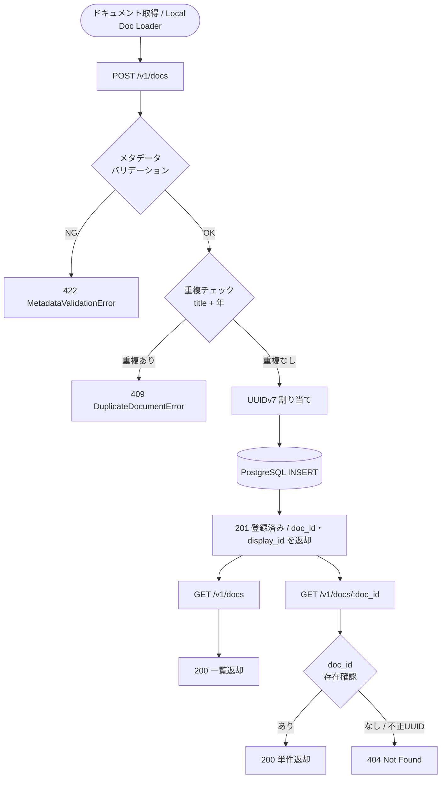

# Doc Relationship Persister

## Overview

Local Doc Loader が出力した Markdown ドキュメント（本文 + Frontmatter メタデータ）を PostgreSQL に永続化する Persister ノード。

ドキュメント間の引用・関係グラフの永続化は `idea_relation_persister`（Neo4j）が担当する。本ノードは**メタデータと本文の永続化**のみを責務とする。

## ドキュメント状態定義

CRUD API を使用する前提として、ドキュメントは以下の状態を持つ。

### 状態一覧

| 状態 | 説明 | `documents` テーブル上の存在 |
|------|------|--------------------------|
| **未登録** | Local Doc Loader が変換済みだが、まだ永続化されていない | なし |
| **登録済み** | UUIDv7 が割り当てられ PostgreSQL に保存されている | あり |
| **重複候補** | 同一 `title` + `date.year` のレコードが既に存在する | あり（別レコード） |

### 状態遷移



### 各状態での API 事前条件

| エンドポイント | 必要な事前状態 | 結果 |
|--------------|-------------|------|
| `POST /v1/docs` | **未登録**（同一 title + 年が存在しない） | `登録済み` に遷移、201 |
| `POST /v1/docs` | **重複候補**（同一 title + 年が存在する） | 遷移なし、409 |
| `GET /v1/docs` | 任意（0 件でも可） | 一覧返却、200 |
| `GET /v1/docs/{doc_id}` | **登録済み** | 単件返却、200 |
| `GET /v1/docs/{doc_id}` | **未登録**（または不正 UUID） | 404 |

> **Note:** UPDATE / DELETE は現在未実装。将来実装する場合は **登録済み** 状態のみを対象とし、`doc_id`（UUIDv7）で指定する。

---

## 保存対象ドキュメントのメタデータ仕様

### 入力フィールド一覧

`POST /v1/docs` に渡す `DocRelationshipPersisterInput` のフィールド定義。

#### `document`（`LocalDocumentOutput`）

Local Doc Loader の出力をそのまま渡す。

| フィールド | 必須 | 型 | 説明 |
|-----------|:---:|----|------|
| `mime` | ✅ | `str` | MIME タイプ（例: `text/markdown`） |
| `markdown` | ✅ | `str` | Markdown 本文（保存対象） |
| `meta.source_file` | ✅ | `str` | 元ファイル名。`display_id` の生成に使用。空文字は不可 |
| `meta.created_at` | ✅ | `str` | 変換日時（ISO 8601）。**保存されない**（DB の `created_at` は INSERT 時刻） |
| `meta.title` | ➖ | `str \| None` | タイトル。省略または空の場合は `source_file` のステムで自動補完 |
| `meta.domain` | ➖ | `str` | 検索ドメイン。デフォルト `"general"`。空文字は不可 |
| `meta.tags` | ➖ | `list[str]` | タグリスト。デフォルト `[]` |

#### 追加メタデータ（呼び出し元が付与）

| フィールド | 必須 | 型 | 説明 |
|-----------|:---:|----|------|
| `author` | ✅ | `str` | 著者名。空文字は不可 |
| `source_type` | ✅ | `SourceType` | 取得元種別。`local_markdown` / `local_pdf` / `web` / `api` / `image` |
| `confidence` | ✅ | `float` | 確信度（`0.0`〜`1.0`） |
| `date` | ✅ | `date` | 公開・取得日。重複チェックの **年** はこのフィールドから取得 |

### 自動生成フィールド（呼び出し元が指定不可）

| フィールド | 生成ルール |
|-----------|-----------|
| `doc_id` | UUIDv7（タイムスタンプ順序付き）。サービスが生成 |
| `display_id` | `"DOC-{source_file のステム}"`（例: `report.md` → `DOC-report`） |
| `created_at`（DB） | INSERT 時刻（UTC）。`meta.created_at` とは独立 |

### 認識されるが保存されないフィールド

| フィールド | 理由 |
|-----------|------|
| `meta.created_at` | Local Doc Loader が付与する変換日時であり、DB 登録日時とは意味が異なる。DB の `created_at` は INSERT 時刻を使用 |

### バリデーションルール

| 条件 | エラー |
|------|--------|
| `author` が空文字または空白のみ | `MetadataValidationError(field="author")` |
| `meta.source_file` が空文字または空白のみ | `MetadataValidationError(field="source_file")` |
| `meta.domain` が空文字または空白のみ | `MetadataValidationError(field="domain")` |
| 同一 `title` + `date.year` のレコードが存在する | `DuplicateDocumentError` |

> **Note:** `title` の空チェックは不要。`FrontmatterMeta` の `ensure_title()` が空タイトルを `source_file` のステムで自動補完するため、バリデーション到達時点で常に非空が保証される。

---

## Responsibilities

- `LocalDocumentOutput`（本文 + Frontmatter）と追加メタデータ（author, source_type, confidence, date）を受け取り PostgreSQL に保存する
- メタデータの整合性を検証し、不正な場合は `MetadataValidationError` を送出する
- 同一 `title` + `date.year` の重複を検出し、`DuplicateDocumentError` を送出する
- 重複がない場合に UUIDv7 を割り当てて INSERT する
- `doc_id`（UUIDv7）および `display_id`（`DOC-{source_file_stem}`）を管理する
- ドメイン・タグによるフィルタリング検索を提供する

## Input / Output 状態定義

### Input 状態

`persist()` を呼び出す前にドキュメントが満たすべき状態。

| 条件 | 説明 |
|------|------|
| Local Doc Loader による変換完了 | `LocalDocumentOutput`（mime / markdown / meta）が揃っている |
| Frontmatter が付与済み | `meta.source_file`・`meta.created_at` が設定されている |
| 呼び出し元メタデータが付与済み | `author`・`source_type`・`confidence`・`date` が確定している |
| PostgreSQL 未登録 | 同一 `title` + `date.year` のレコードが存在しない |

上記を満たさない場合、`persist()` は以下を送出する。

| 違反条件 | 例外 |
|---------|------|
| 必須フィールドが空 | `MetadataValidationError` |
| 同一 title + 年が既存 | `DuplicateDocumentError` |

### Output 状態

`persist()` が正常終了した後の `DocRelationshipPersisterOutput` の保証。

| フィールド | 保証される状態 |
|-----------|--------------|
| `doc_id` | 有効な UUIDv7 文字列（バージョン 7、重複なし） |
| `display_id` | `"DOC-"` プレフィックス付きの `source_file` ステム |
| `title` | 非空文字列（空入力時は `source_file` ステムで補完済み） |
| `source_file` | 入力値をそのまま保持 |
| `domain` | 非空文字列（未指定時は `"general"`） |
| `tags` | リスト（空リストも有効） |
| `author` | 入力値をそのまま保持（非空保証） |
| `source_type` | `SourceType` の有効な値 |
| `confidence` | `0.0 ≤ confidence ≤ 1.0` |
| `date` | 入力値をそのまま保持 |
| `created_at` | INSERT 時刻の ISO 8601 文字列（UTC） |

## Data Flow

```
LocalDocumentOutput + DocRelationshipPersisterInput
  → DocRelationshipPersisterService.persist()
  → DocumentRecord (PostgreSQL: documents テーブル)
  → DocRelationshipPersisterOutput
```

## Schema

### 入力: `DocRelationshipPersisterInput`

| フィールド | 型 | 説明 |
|-----------|---|------|
| document | `LocalDocumentOutput` | Local Doc Loader の出力（本文 + Frontmatter） |
| author | `str` | 著者名 |
| source_type | `SourceType` | 取得元種別（`local_markdown` / `local_pdf` / `web` / `api` / `image`） |
| confidence | `float` | 確信度（0.0〜1.0） |
| date | `date` | 公開・取得日 |

### 出力: `DocRelationshipPersisterOutput`

| フィールド | 型 | 説明 |
|-----------|---|------|
| doc_id | `str` | ドキュメント識別子（source_file のステム） |
| title | `str` | ドキュメントタイトル |
| source_file | `str` | 元ファイル名 |
| domain | `str` | 検索ドメイン |
| tags | `list[str]` | タグリスト |
| author | `str` | 著者名 |
| source_type | `SourceType` | 取得元種別 |
| confidence | `float` | 確信度 |
| date | `date` | 公開・取得日 |
| created_at | `str` | レコード作成日時（ISO 8601） |

### ORM モデル: `DocumentRecord`（`documents` テーブル）

| カラム | 型 | 備考 |
|--------|---|------|
| id | UUID | 主キー |
| doc_id | VARCHAR | UNIQUE, INDEX |
| title | VARCHAR | |
| source_file | VARCHAR | |
| mime | VARCHAR | |
| body | TEXT | Markdown 本文 |
| domain | VARCHAR | |
| tags | JSON | `list[str]` |
| author | VARCHAR | |
| source_type | VARCHAR | `SourceType.value` |
| confidence | FLOAT | 0.0〜1.0 |
| date | DATE | |
| created_at | TIMESTAMPTZ | |

## API エンドポイント

| Method | Path | 説明 |
|--------|------|------|
| POST | `/v1/docs` | ドキュメント永続化（upsert） |
| GET | `/v1/docs` | 一覧取得（`?domain=`, `?limit=`, `?offset=`） |
| GET | `/v1/docs/{doc_id}` | 単件取得 |

## Acceptance Criteria

- Local Doc Loader の出力を受け取り PostgreSQL に保存できる
- 同一 `doc_id` への再永続化が upsert になる（冪等性）
- `domain` でフィルタリングした一覧取得ができる
- `doc_id` で単件取得ができ、存在しない場合は 404 を返す
- Docker Compose で PostgreSQL が起動した状態でサーバーが初期化時にテーブルを作成する

## Related Files

| ファイル | 役割 |
|---------|------|
| [types.py](../../backend/src/origin_spyglass/doc_relationship_persister/types.py) | 入出力スキーマ定義 |
| [service.py](../../backend/src/origin_spyglass/doc_relationship_persister/service.py) | `DocRelationshipPersisterService` 実装 |
| [__init__.py](../../backend/src/origin_spyglass/doc_relationship_persister/__init__.py) | パブリック API |
| [infra/vector_store.py](../../backend/src/origin_spyglass/infra/vector_store.py) | `DocumentRecord` ORM / `VectorStoreManager` |
| [api/v1/docs.py](../../backend/src/origin_spyglass/api/v1/docs.py) | FastAPI ルーター |

テストは `backend/tests/doc_relationship_persister/` および `backend/tests/api/v1/test_docs.py` に配置する。

## Test Cases

### 正常系

1. **persist() — 新規作成** — 入力から `DocumentRecord` が INSERT され `doc_id` が source_file のステムになる
2. **persist() — 冪等性** — 同一 `doc_id` への再 persist() が upsert になりレコードが 1 件のみ残る
3. **list_documents() — 全件取得** — 複数ドキュメント登録後に全件が返る
4. **list_documents(domain=...)** — ドメインフィルタが正しく機能する
5. **get_document() — 存在あり** — 登録済み `doc_id` でレコードが返る
6. **get_document() — 存在なし** — 未登録 `doc_id` で None が返る

### API 正常系

7. **POST /v1/docs** — 201 + `DocRelationshipPersisterOutput`
8. **GET /v1/docs** — 200 + リスト
9. **GET /v1/docs/{doc_id}** — 200 + 単件

### API 異常系

10. **POST /v1/docs（不正スキーマ）** — 422
11. **GET /v1/docs/{doc_id}（存在なし）** — 404
