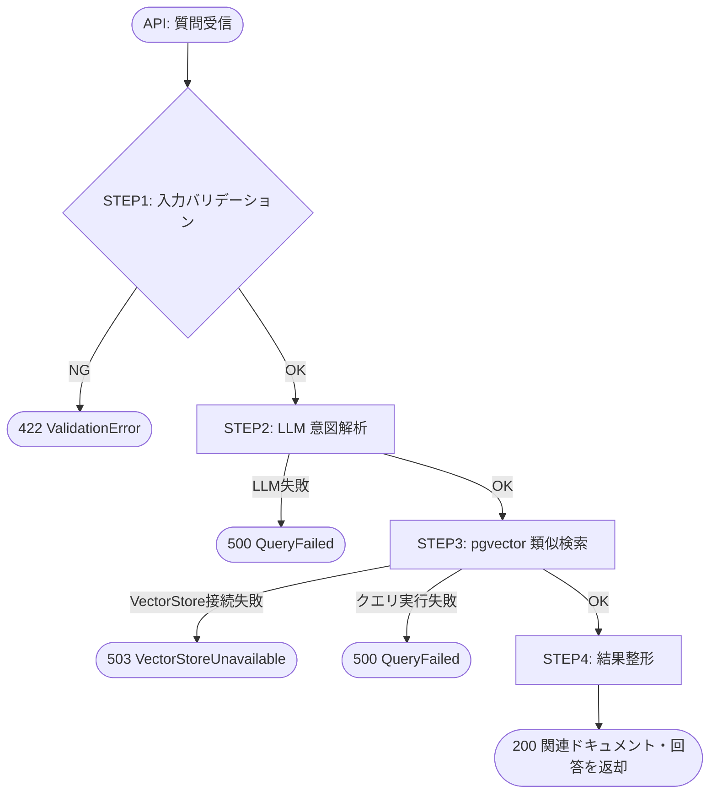
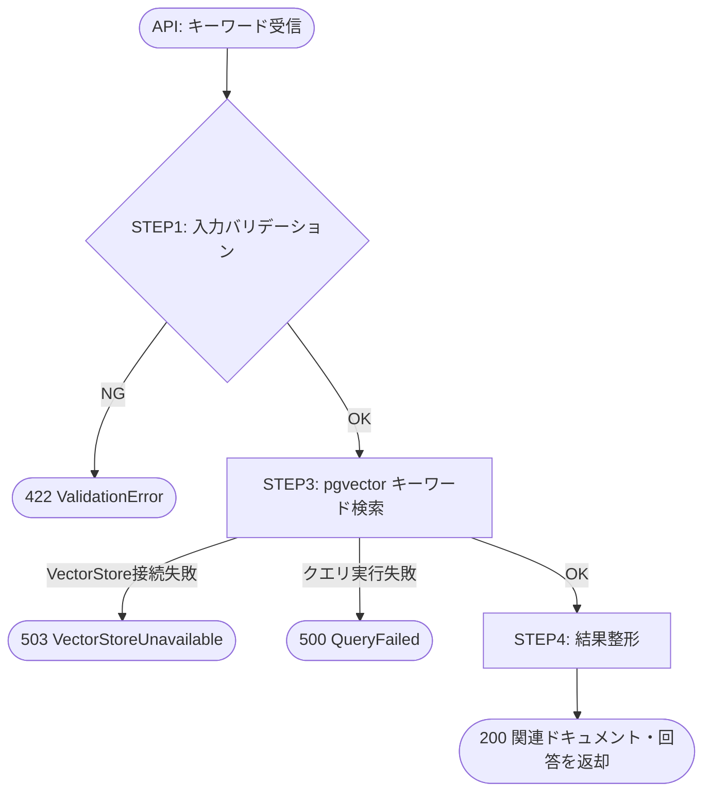
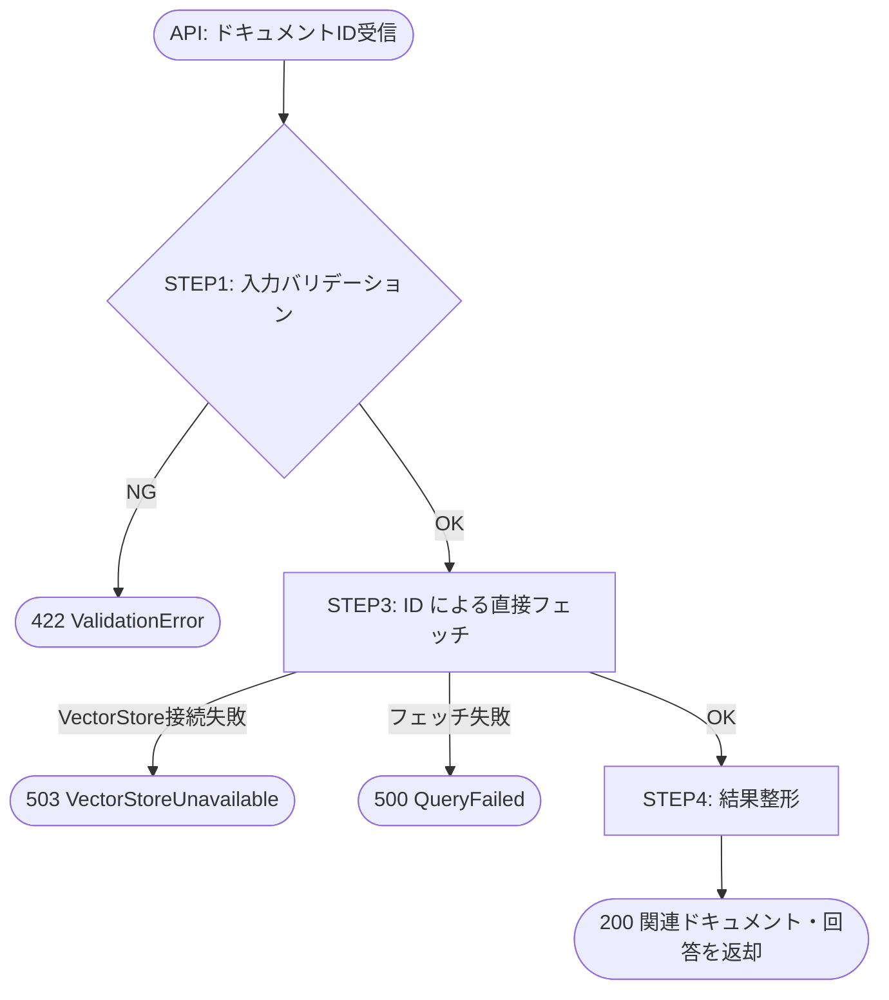

# Doc Retrieverノード

## Overview

Doc Retriever は、Postgres（pgvector）に保存された文書を検索し、関連するドキュメントのリストと LLM が生成した回答を返す Gatherer ノード。
入力は以下の3種類を想定する。

### Retrieval Functions

**retrieval_with_text**: 自然言語質問 + フィルタ → 関連ドキュメント + 回答
- 入力: `question`（自然言語）+ オプションフィルタ（`domain`, `max_results`, `user_id`）
- 処理: 入力バリデーション → LLM による意図解析 → ベクトル検索 → 結果整形

**retrieval_with_keywords**: キーワードのリスト + フィルタ → 関連ドキュメント + 回答
- 入力: `keywords`（キーワードのリスト）+ オプションフィルタ（`domain`, `max_results`, `user_id`）
- 処理: 入力バリデーション → ベクトル検索（LLM 意図解析なし）→ 結果整形

**retrieval_with_doc_ids**: ドキュメントIDのリスト → 関連ドキュメント + 回答
- 入力: `doc_ids`（ドキュメントIDのリスト）+ オプションフィルタ（`user_id`）
- 処理: 入力バリデーション → ID による直接フェッチ → 結果整形

責務:
- 質問の理解（意図・キーワードの抽出）
- ドキュメントストアへのクエリ実行
- 回答の生成
- 結果の整形

## Scope

- **対象**: 自然言語質問 / キーワード / ドキュメントID → Postgres(pgvector) 検索 → 回答生成
- **非対象**: Document Store(Postgres) へのデータ書き込み（Doc Relationship Persister の責務）
- **順序制約**: Doc Relationship Persister によってデータが保存済みであることを前提とする

## 状態遷移

### 共通構造

すべてのフローで STEP1（バリデーション）と STEP4（結果整形）は共通。STEP2・STEP3 は関数ごとに異なる。

| フロー | STEP2 | STEP3 |
|---|---|---|
| retrieval_with_text | LLM 意図解析あり | ベクトル類似検索 |
| retrieval_with_keywords | なし（スキップ） | キーワードベースのベクトル検索 |
| retrieval_with_doc_ids | なし（スキップ） | ID による直接フェッチ |

### フロー1: retrieval_with_text



### フロー2: retrieval_with_keywords



### フロー3: retrieval_with_doc_ids



### エラーパスの補足

| エラー種別 | 発生ステップ | HTTP ステータス | 例外クラス |
|---|---|---|---|
| 入力不正（空文字、範囲外） | STEP1 | 422 | `DocRetrieverValidationError` |
| LLM 応答失敗・タイムアウト | STEP2 | 500 | `QueryFailed` |
| Postgres 接続不可 | STEP3 | 503 | `VectorStoreUnavailable` |
| クエリ実行例外 | STEP3 | 500 | `QueryFailed` |

## STEP 詳細

### STEP1: 入力バリデーション

**担当**: `validation.py`

各入力型ごとのルール:

- `DocTextRetrieverInput`:
  - `question`: 非空・空白のみ禁止
  - `max_results`: 1以上100以下（デフォルト10）
  - `domain`: 指定された場合は非空・空白のみ禁止
- `DocKeywordsRetrieverInput`:
  - `keywords`: 1件以上・各要素が非空・空白のみ禁止
  - `max_results`: 1以上100以下（デフォルト10）
  - `domain`: 指定された場合は非空・空白のみ禁止
- `DocIdsRetrieverInput`:
  - `doc_ids`: 1件以上・各要素が非空

**成功時**: `ValidatedInput`（各 Input 型の型エイリアス）として次ステップへ渡す

### STEP2: 意図解析（retrieval_with_text のみ）

**担当**: `interpret.py`

- LLM を使用して質問の意図を解析し、ベクトル検索に適したクエリ文字列を生成する
- 入力テキストの精製・言い換え・キーワード抽出を行い、`VectorStoreManager.retrieval_with_text()` への入力文字列を返す
- 例: "量子コンピュータと古典コンピュータの関係は？" → "量子コンピュータ 古典コンピュータ 比較 関係"
- LLM 呼び出し失敗時は `QueryFailed` を送出する

> `retrieval_with_keywords` と `retrieval_with_doc_ids` はこのステップをスキップする。

### STEP3: VectorStore 探索

**担当**: `query_retrieve.py`

- 入力種別に応じて `VectorStoreManager` の対応メソッドを呼び出す薄いラッパー
- Postgres 接続不可時は `VectorStoreUnavailable`、実行時例外は `QueryFailed` を送出

```python
# retrieval_with_text: 類似検索（STEP2 の解析済みクエリを使用）
manager.retrieval_with_text(
    query_text=interpreted_query,
    max_results=input.max_results,
    domain=input.domain,
)

# retrieval_with_keywords: キーワードリストからベクトル検索
manager.retrieval_with_keywords(
    keywords=input.keywords,
    max_results=input.max_results,
    domain=input.domain,
)

# retrieval_with_doc_ids: ID による直接フェッチ
manager.retrieval_with_doc_ids(
    doc_ids=input.doc_ids,
)
```

### STEP4: 結果整形

**担当**: `express.py`

- クエリ結果を各 Output 型に整形して返却
- `answer`: LLM が生成した回答文（ID フェッチの場合は文書サマリー）
- `related_docs`: 関連ドキュメントを `RetrievedDoc` のリストに変換
- `elapsed_ms`: 処理時間を付与
- 関連ドキュメントが0件の場合も空リストとして正常返却する（エラーにしない）
- ノード変換の失敗は best-effort で `warnings` に記録して継続する

## モジュール構成

### ファイル構成と責務

```
doc_retriever/
├── __init__.py            # 公開インターフェース
├── types.py               # 入出力スキーマ・エラー型
├── pipeline.py            # STEP1〜4 のオーケストレーション
├── validation.py          # STEP1: 入力バリデーション
├── interpret.py           # STEP2: LLM 意図解析（text のみ）
├── query_retrieve.py   # STEP3: VectorStore 探索
└── express.py             # STEP4: 結果整形・出力
```

### STEP と担当モジュールの対応

| STEP | 内容 | 担当モジュール |
|---|---|---|
| STEP1 | 入力バリデーション | `validation.py` |
| STEP2 | LLM 意図解析（text のみ） | `interpret.py` |
| STEP3 | VectorStore 探索 | `query_retrieve.py` |
| STEP4 | 結果整形 | `express.py` |
| オーケストレーション | STEP1→4 の順次実行 | `pipeline.py` |
| HTTP エラーマッピング | 型付き例外 → HTTP ステータス変換 | `api/v1/docs.py`（ルーター直接） |

### 依存モジュール

| モジュール | 役割 |
|---|---|
| `infra/vector_store.py` | `VectorStoreManager`（検索メソッドを拡張して使用） |
| `doc_relationship_persister/types.py` | `VectorStoreUnavailable`（新規追加） |

### VectorStoreManager の拡張

既存の `VectorStoreManager`（`infra/vector_store.py`）に以下の検索メソッドを追加する。

| メソッド | 説明 |
|---|---|
| `retrieval_with_text(query_text, max_results, domain)` | pgvector 類似検索（テキストをベクトル化してコサイン類似度で検索） |
| `retrieval_with_keywords(keywords, max_results, domain)` | キーワードリストを結合してベクトル検索 |
| `retrieval_with_doc_ids(doc_ids)` | ID リストによる直接フェッチ |

### 新設対象

| モジュール | クラス/関数 | 役割 |
|---|---|---|
| `doc_retriever/__init__.py` | `DocRetrieverPipeline`, 各 Input/Output 型 | 公開インターフェース |
| `doc_retriever/types.py` | 各 Input/Output 型、`DocRetrieverValidationError`, `QueryFailed` | 入出力・エラー型定義 |
| `doc_retriever/pipeline.py` | `DocRetrieverPipeline.run_text()`, `run_keywords()`, `run_doc_ids()` | STEP1〜4 のオーケストレーション |
| `doc_retriever/validation.py` | `validate_text()`, `validate_keywords()`, `validate_doc_ids()` | STEP1: 入力バリデーション |
| `doc_retriever/interpret.py` | `interpret()` | STEP2: LLM 意図解析（text のみ） |
| `doc_retriever/query_retrieve.py` | `explore_by_text()`, `explore_by_keywords()`, `fetch_by_ids()` | STEP3: VectorStore 探索 |
| `doc_retriever/express.py` | `express_text()`, `express_keywords()`, `express_doc_ids()` | STEP4: 結果整形 |
| `api/v1/docs.py` | 3 エンドポイント追加 | HTTP エラーマッピング付きルーター |
| `doc_relationship_persister/types.py` | `VectorStoreUnavailable` | Postgres 接続不可エラー型（新規追加） |
| `infra/vector_store.py` | `retrieval_with_text()`, `retrieval_with_keywords()`, `retrieval_with_doc_ids()` | VectorStoreManager の検索メソッド拡張 |

### 型定義（`types.py`）

```python
# --- 共通 ---

class RetrievedDoc(BaseModel):
    node_id: str
    title: str
    body_snippet: str
    relevance_score: float = Field(ge=0.0, le=1.0)


class DocRetrieverValidationError(ValueError):
    def __init__(self, field: str, reason: str) -> None:
        self.field = field
        self.reason = reason
        super().__init__(f"[validation] field={field} reason={reason}")


class QueryFailed(Exception):
    """LLM 失敗またはクエリ実行失敗"""


# --- retrieval_with_text ---

class DocTextRetrieverInput(BaseModel):
    question: str
    max_results: int = Field(default=10, ge=1, le=100)
    domain: str | None = None
    user_id: str | None = None

ValidatedTextInput = DocTextRetrieverInput

class DocTextRetrieverOutput(BaseModel):
    question: str
    answer: str
    related_docs: list[RetrievedDoc]
    elapsed_ms: int
    warnings: list[str] = Field(default_factory=list)


# --- retrieval_with_keywords ---

class DocKeywordsRetrieverInput(BaseModel):
    keywords: list[str]
    max_results: int = Field(default=10, ge=1, le=100)
    domain: str | None = None
    user_id: str | None = None

ValidatedKeywordsInput = DocKeywordsRetrieverInput

class DocKeywordsRetrieverOutput(BaseModel):
    keywords: list[str]
    answer: str
    related_docs: list[RetrievedDoc]
    elapsed_ms: int
    warnings: list[str] = Field(default_factory=list)


# --- retrieval_with_doc_ids ---

class DocIdsRetrieverInput(BaseModel):
    doc_ids: list[str]
    user_id: str | None = None

ValidatedIdsInput = DocIdsRetrieverInput

class DocIdsRetrieverOutput(BaseModel):
    doc_ids: list[str]
    answer: str
    related_docs: list[RetrievedDoc]
    elapsed_ms: int
    warnings: list[str] = Field(default_factory=list)
```

## API Input / Output 定義

既存の `api/v1/docs.py` ルーターに以下の3エンドポイントを追加する。

### retrieval_with_text

- エンドポイント: `POST /v1/docs/retrieval/text`

#### Request (`DocTextRetrieverInput`)

| フィールド | 型 | 必須 | 説明 |
|---|---|:---:|---|
| `question` | `str` | ✅ | 自然言語の質問文 |
| `max_results` | `int` | ➖ | 返す関連ドキュメントの最大数（デフォルト10、1〜100） |
| `domain` | `str \| null` | ➖ | 検索対象ドメインのフィルタ |
| `user_id` | `str \| null` | ➖ | 質問者の識別子（ログ用、出力には含まれない） |

#### Response (`DocTextRetrieverOutput`)

| フィールド | 型 | 説明 |
|---|---|---|
| `question` | `str` | 入力された質問文 |
| `answer` | `str` | LLM が生成した回答文 |
| `related_docs` | `list[RetrievedDoc]` | 関連ドキュメントのリスト（0件の場合は空リスト） |
| `elapsed_ms` | `int` | 処理時間（ms） |
| `warnings` | `list[str]` | 軽微な警告（best-effort 処理の失敗など） |

---

### retrieval_with_keywords

- エンドポイント: `POST /v1/docs/retrieval/keywords`

#### Request (`DocKeywordsRetrieverInput`)

| フィールド | 型 | 必須 | 説明 |
|---|---|:---:|---|
| `keywords` | `list[str]` | ✅ | 検索キーワードのリスト（1件以上） |
| `max_results` | `int` | ➖ | 返す関連ドキュメントの最大数（デフォルト10、1〜100） |
| `domain` | `str \| null` | ➖ | 検索対象ドメインのフィルタ |
| `user_id` | `str \| null` | ➖ | 質問者の識別子（ログ用、出力には含まれない） |

#### Response (`DocKeywordsRetrieverOutput`)

| フィールド | 型 | 説明 |
|---|---|---|
| `keywords` | `list[str]` | 入力されたキーワードリスト |
| `answer` | `str` | LLM が生成した回答文 |
| `related_docs` | `list[RetrievedDoc]` | 関連ドキュメントのリスト（0件の場合は空リスト） |
| `elapsed_ms` | `int` | 処理時間（ms） |
| `warnings` | `list[str]` | 軽微な警告（best-effort 処理の失敗など） |

---

### retrieval_with_doc_ids

- エンドポイント: `POST /v1/docs/retrieval/doc-ids`

#### Request (`DocIdsRetrieverInput`)

| フィールド | 型 | 必須 | 説明 |
|---|---|:---:|---|
| `doc_ids` | `list[str]` | ✅ | 取得するドキュメントIDのリスト（1件以上） |
| `user_id` | `str \| null` | ➖ | 質問者の識別子（ログ用、出力には含まれない） |

#### Response (`DocIdsRetrieverOutput`)

| フィールド | 型 | 説明 |
|---|---|---|
| `doc_ids` | `list[str]` | 入力されたドキュメントIDリスト |
| `answer` | `str` | LLM が生成した回答文（取得ドキュメントのサマリー） |
| `related_docs` | `list[RetrievedDoc]` | 取得ドキュメントのリスト（0件の場合は空リスト） |
| `elapsed_ms` | `int` | 処理時間（ms） |
| `warnings` | `list[str]` | 軽微な警告（best-effort 処理の失敗など） |

---

`RetrievedDoc` の各フィールド:

| フィールド | 型 | 説明 |
|---|---|---|
| `node_id` | `str` | ドキュメントの内部 ID |
| `title` | `str` | ドキュメントタイトル |
| `body_snippet` | `str` | 本文の抜粋 |
| `relevance_score` | `float` | 関連度スコア（0.0〜1.0） |

## バリデーションルール

| 条件 | ルール | エラー |
|---|---|---|
| `question` | 非空、空白のみ禁止 | `DocRetrieverValidationError(question)` → 422 |
| `keywords` | 1件以上、各要素が非空・空白のみ禁止 | `DocRetrieverValidationError(keywords)` → 422 |
| `doc_ids` | 1件以上、各要素が非空 | `DocRetrieverValidationError(doc_ids)` → 422 |
| `max_results` | `1 <= x <= 100` | `DocRetrieverValidationError(max_results)` → 422 |
| `domain` | 指定時は非空・空白のみ禁止 | `DocRetrieverValidationError(domain)` → 422 |
| LLM 応答失敗 | タイムアウト / パース失敗 | `QueryFailed` → 500 |
| Postgres 接続不可 | VectorStore 未接続 | `VectorStoreUnavailable` → 503 |
| クエリ実行例外 | VectorStore クエリ例外 | `QueryFailed` → 500 |

## 正常系 / 異常系テスト設計

## 配置方針（ミラー）

- 実装: `backend/src/origin_spyglass/doc_retriever/`
- テスト: `backend/tests/doc_retriever/`

### テストファイル対応

| テストファイル | 対象モジュール |
|---|---|
| `_helpers.py` | 共通テストデータファクトリ |
| `test_validation.py` | `validation.py` |
| `test_interpret.py` | `interpret.py` |
| `test_query_retrieve.py` | `query_retrieve.py` |
| `test_express.py` | `express.py` |
| `test_pipeline.py` | `pipeline.py` |
| `tests/api/v1/test_docs.py` | `api/v1/docs.py` |

### 正常系

**retrieval_with_text**
1. 通常の質問: 質問に対して関連ドキュメントリストと回答文が返される
2. `domain` フィルタ適用: `domain` 指定時にクエリに反映される
3. `max_results` 反映: `max_results=5` が `retrieval_with_text(max_results=5)` に渡される
4. 関連0件: Postgres に関連ドキュメントが存在しない場合、`related_docs=[]` で正常返却

**retrieval_with_keywords**
5. 通常のキーワード検索: キーワードリストに対して関連ドキュメントリストと回答文が返される
6. `domain` フィルタ適用: `domain` 指定時にクエリに反映される
7. 関連0件: ヒットなしの場合、`related_docs=[]` で正常返却

**retrieval_with_doc_ids**
8. 通常の ID フェッチ: 指定 ID のドキュメントが `related_docs` に含まれる
9. 存在しない ID: 該当なしのみの場合、`related_docs=[]` で正常返却
10. `user_id` 受け付け: `user_id` 指定時にバリデーション通過し、ログに記録される

### バリデーション異常系

11. `question` 空文字: `question=""` → 422
12. `question` 空白のみ: `question="   "` → 422
13. `max_results=0`: 下限違反 → 422
14. `max_results=101`: 上限超過 → 422
15. `domain` 空白のみ: `domain="  "` → 422
16. `keywords` 空リスト: `keywords=[]` → 422
17. `keywords` に空白のみ要素: `keywords=["  "]` → 422
18. `doc_ids` 空リスト: `doc_ids=[]` → 422

### 外部依存障害

19. LLM タイムアウト: interpret ステップで LLM 失敗 → 500 QueryFailed（text のみ）
20. Postgres 接続不可: query_retrieve ステップで接続失敗 → 503 VectorStoreUnavailable
21. クエリ実行例外: VectorStore メソッドが例外送出 → 500 QueryFailed
22. クエリ結果0件（正常）: Postgres 接続可・ヒットなし → 正常（空リスト返却）

### パイプライン統合テスト

23. text の実行順序: `validate → interpret → explore_by_text → express_text` の順で呼ばれること
24. keywords の実行順序: `validate → explore_by_keywords → express_keywords` の順で呼ばれること（interpret スキップ）
25. doc_ids の実行順序: `validate → fetch_by_ids → express_doc_ids` の順で呼ばれること（interpret スキップ）
26. interpret 失敗で停止: text フローで interpret エラー発生時に後続ステップが呼ばれないこと
27. query_retrieve 失敗で停止: クエリエラー発生時にパイプラインが停止すること

### API テスト

28. `POST /v1/docs/retrieval/text` 正常: 200 + `DocTextRetrieverOutput` スキーマ確認
29. `POST /v1/docs/retrieval/keywords` 正常: 200 + `DocKeywordsRetrieverOutput` スキーマ確認
30. `POST /v1/docs/retrieval/doc-ids` 正常: 200 + `DocIdsRetrieverOutput` スキーマ確認
31. バリデーション: `question=""` → 422
32. Postgres 障害: 接続失敗 → 503

### `_helpers.py` ファクトリ関数

```python
def make_text_input(**overrides: object) -> DocTextRetrieverInput:
    defaults = {
        "question": "量子コンピュータと古典コンピュータの関係は？",
        "max_results": 10,
        "domain": None,
        "user_id": None,
    }
    defaults.update(overrides)
    return DocTextRetrieverInput(**defaults)


def make_keywords_input(**overrides: object) -> DocKeywordsRetrieverInput:
    defaults = {
        "keywords": ["量子コンピュータ", "古典コンピュータ"],
        "max_results": 10,
        "domain": None,
        "user_id": None,
    }
    defaults.update(overrides)
    return DocKeywordsRetrieverInput(**defaults)


def make_ids_input(**overrides: object) -> DocIdsRetrieverInput:
    defaults = {
        "doc_ids": ["doc-001", "doc-002"],
        "user_id": None,
    }
    defaults.update(overrides)
    return DocIdsRetrieverInput(**defaults)


def make_retrieved_doc(**overrides: object) -> RetrievedDoc:
    defaults = {
        "node_id": "node-001",
        "title": "量子コンピュータ",
        "body_snippet": "量子コンピュータは量子力学の原理を...",
        "relevance_score": 0.92,
    }
    defaults.update(overrides)
    return RetrievedDoc(**defaults)


def make_text_output(**overrides: object) -> DocTextRetrieverOutput:
    defaults = {
        "question": "量子コンピュータと古典コンピュータの関係は？",
        "answer": "量子コンピュータは古典コンピュータとは異なる計算原理を持ち...",
        "related_docs": [make_retrieved_doc()],
        "elapsed_ms": 120,
        "warnings": [],
    }
    defaults.update(overrides)
    return DocTextRetrieverOutput(**defaults)


def make_keywords_output(**overrides: object) -> DocKeywordsRetrieverOutput:
    defaults = {
        "keywords": ["量子コンピュータ", "古典コンピュータ"],
        "answer": "量子コンピュータは古典コンピュータとは異なる計算原理を持ち...",
        "related_docs": [make_retrieved_doc()],
        "elapsed_ms": 80,
        "warnings": [],
    }
    defaults.update(overrides)
    return DocKeywordsRetrieverOutput(**defaults)


def make_ids_output(**overrides: object) -> DocIdsRetrieverOutput:
    defaults = {
        "doc_ids": ["doc-001", "doc-002"],
        "answer": "指定されたドキュメントの内容は...",
        "related_docs": [make_retrieved_doc()],
        "elapsed_ms": 50,
        "warnings": [],
    }
    defaults.update(overrides)
    return DocIdsRetrieverOutput(**defaults)
```

## Acceptance Criteria

- 自然言語の質問を入力として受け取り、Postgres(pgvector) から関連ドキュメントを検索して返せる
- キーワードリストを入力として受け取り、ベクトル検索できる（LLM 意図解析なし）
- ドキュメントIDリストを入力として受け取り、直接フェッチできる
- `max_results` と `domain` フィルタが検索に反映される
- LLM による意図解析結果がクエリ文字列として `retrieval_with_text()` に渡される
- 関連0件でも正常返却し、エラーにしない
- 入力不正・外部依存障害を原因別にエラー返却できる
- `backend/src` と `backend/tests` のミラー構成でテストが揃う
- 既存の `api/v1/docs.py` に3エンドポイントが追加される
- `VectorStoreManager` に3つの検索メソッドが追加される
- `VectorStoreUnavailable` が `doc_relationship_persister/types.py` に追加される
