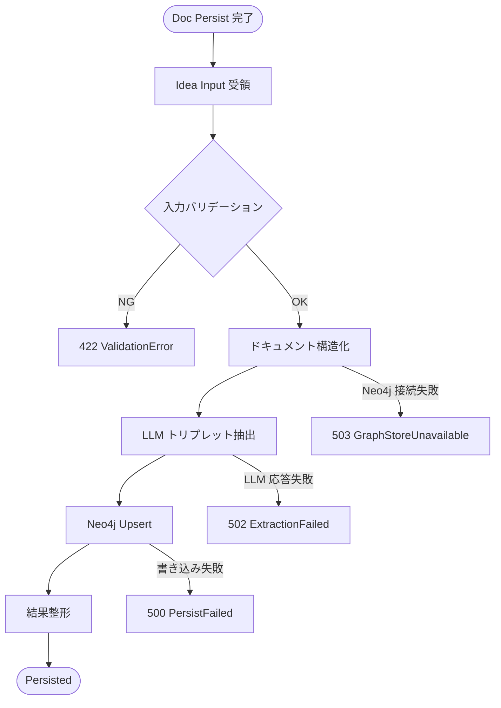

# Idea Relation Persister

## Overview

Idea Relation Persister は、Doc Relation Persister が払い出した `doc_id` をキーに、
Frontmatter + Body から概念と関係を抽出して Neo4j に永続化する Persister ノード。

- 入力: `doc_id` + `frontmatter`（`IdeaFrontmatterMeta`）+ `body_text`
- 処理: 2段階ドキュメント構造化 + LLM ベースのトリプレット抽出
- 出力: Neo4j に保存された概念ノードと関係エッジ

`docs/architecture.md` の Persister 分割、および `docs/user-journey.md` の
Gathering フェーズ（Doc -> Rel の順）に準拠する。

> **命名方針**: Neo4j への書き込みは `persist` で統一する。
> `doc_relationship_persister` モジュールの命名は別チケットで `doc_relation_persister` に修正予定。

## Scope

- **対象**: 概念・関係の抽出と Neo4j 永続化
- **非対象**: 元文書本文の主保存（PostgreSQL 側で実施）
- **順序制約**: 必ず Doc Relation Persister の後に実行する

## コードベース探索結果

### 直接の対象

| ファイル | 現状 | 役割 |
|---|---|---|
| `backend/src/origin_spyglass/idea_relation_persister/` | 未作成 | Idea Relation Persister の新規実装配置先 |
| `backend/src/origin_spyglass/doc_relationship_persister/service.py` | 実装済み | 上流で `doc_id` を払い出す前段サービス |
| `backend/src/origin_spyglass/infra/graph_store.py` | 実装済み | Neo4j 接続管理。すべての Neo4j 操作の入口 |

### 依存モジュール

| ファイル | 役割 |
|---|---|
| `backend/src/origin_spyglass/infra/graph_store.py` | Neo4j 接続管理（`Neo4jGraphStoreManager`, `PropertyGraphStore`） |
| `backend/src/origin_spyglass/local_doc_loader/types.py` | `FrontmatterMeta`（`IdeaFrontmatterMeta` の基底クラス） |
| `backend/src/origin_spyglass/schemas/doc_relation.py` | `SourceType` の共有スキーマ |

### ギャップ（未実装）

- `idea_relation_persister` モジュール（下記「新設対象」一覧）が未作成
- Idea Relation Persister 専用の API ルーターが未定義
- `idea_relation_persister` のユニットテストが未作成

## 状態遷移（FlowchartTD）



## STEP 詳細

### STEP0: 前提データの確定

- Local Doc Loader が Markdown + Frontmatter を生成済み
- Doc Relation Persister が `doc_id` を払い出し済み
- ここで受け取る最小単位は 1 ドキュメント

**入力要件**
- `doc_id`
- `frontmatter`（`IdeaFrontmatterMeta`: `domain`, `tags`, `title`, `source_file`, `source_type`, `confidence`, `date` を含む）
- `body_text`

### STEP1: 入力バリデーション

**担当**: `validation.py`

- 必須項目の存在と型を検証
- Frontmatter 内の relation 文脈 (`domain`, `source_type`, `confidence`, `date`) を検証
- `chunk_size`, `chunk_overlap` の関係を検証
- `body_text` に XML prefix を検出した場合は異常入力として拒否（422）

> **Policy:** XML prefix は将来的にも対応しない。Frontmatter はすでに parse され
> `IdeaFrontmatterMeta` として入力に渡される前提のため、XML 形式を受け付ける設計にしない。

**成功時**
- `ValidatedIdeaRelationInput` に正規化して次ステップへ渡す

### STEP2: ドキュメント構造化

**担当**: `structure.py`

Frontmatter と Body を 2 段階で分割する。

**フェーズ 1: MD タグによる構造分離**
- Frontmatter を `metadata` セクションとして再構成し、`domain/tags/title/source_type` を明示
- `MarkdownNodeParser` で見出し（`#`, `##` 等）単位に分割
- `HeadingContextInjector` で見出しパンくずを各チャンクに注入

**フェーズ 2: コンテキスト長による再分割**
- `SentenceSplitter` で `chunk_size / chunk_overlap` に基づきさらに分割

**狙い**
- セクション境界を LLM に保持させ、誤リンクを減らす
- Frontmatter のメタデータを本文と切り離してノイズを抑える

### STEP3: 関係抽出

**担当**: `extractor.py`

- `SimpleLLMPathExtractor` で (subject, predicate, object) を抽出
- Frontmatter の `domain/tags/source_type/title` を抽出ヒントとして参照
- 日本語プロンプトを使用し、Markdown 記号混入を防ぐ

**抽出結果の要件**
- エンティティ文字列が空でない
- 述語がストップワードのみにならない
- Frontmatter の `domain` と矛盾する関係が多発する場合は warning に記録

### STEP4: Neo4j 永続化

**担当**: `persist.py`

- `PropertyGraphIndex.from_documents(...)` で Neo4j に書き込み
- ノード・エッジに `doc_id` を属性として保持
- 再実行時は upsert 相当の冪等性を担保
- `graph_store.py` の `Neo4jGraphStoreManager` / `PropertyGraphStore` 経由でアクセスする

### STEP5: 結果整形

**担当**: `express.py`

- doc 単位で保存結果を `IdeaRelationPersisterOutput` に整形して返却
- `node_count`, `edge_count`, `elapsed_ms`, `warnings` を付与
- 失敗時は原因別エラーを上位に伝播する

## モジュール構成

### ファイル構成と責務

```
idea_relation_persister/
├── __init__.py        # 公開インターフェース
├── types.py           # 入出力スキーマ・エラー型
├── pipeline.py        # オーケストレーション（STEP1〜5 を順に呼び出す）
├── validation.py      # STEP1: 入力バリデーション
├── structure.py       # STEP2: ドキュメント構造化（2 段階分割）
├── extractor.py       # STEP3: LLM トリプレット抽出
├── persist.py         # STEP4: Neo4j 永続化
└── express.py         # STEP5: 結果整形・出力
```

> **`service.py` を置かない理由**: 業務ロジックはステップファイル群に分散し、
> `pipeline.py` がオーケストレーションを担う。HTTP エラーマッピングは
> 既存の `docs.py` と同様にルーター（`api/v1/ideas.py`）で直接行う。
> `service.py` を挟んでも pass-through にしかならないため省略する。

### STEP と担当モジュールの対応

| STEP | 内容 | 担当モジュール |
|---|---|---|
| STEP1 | 入力バリデーション | `validation.py` |
| STEP2 | ドキュメント構造化 | `structure.py` |
| STEP3 | LLM トリプレット抽出 | `extractor.py` |
| STEP4 | Neo4j 永続化 | `persist.py` |
| STEP5 | 結果整形 | `express.py` |
| オーケストレーション | STEP1→5 の順次実行 | `pipeline.py` |
| HTTP エラーマッピング | 型付き例外 → HTTP ステータス変換 | `api/v1/ideas.py`（ルーター直接） |

### 現状（既存モジュール）

| モジュール | クラス/関数 | 役割 |
|---|---|---|
| `doc_relationship_persister/service.py` | `DocRelationshipPersisterService.persist()` | `doc_id` を払い出す前段サービス |
| `infra/graph_store.py` | `Neo4jGraphStoreManager`, `PropertyGraphStore` | Neo4j 接続管理 |
| `api/v1/docs.py` | `POST /v1/docs` | Doc メタデータ登録 API |

### 新設対象

| モジュール | クラス/関数 | 役割 |
|---|---|---|
| `idea_relation_persister/__init__.py` | `IdeaRelationPersisterPipeline`, `IdeaRelationPersisterInput`, `IdeaRelationPersisterOutput` | 公開インターフェース |
| `idea_relation_persister/types.py` | `IdeaFrontmatterMeta`, `IdeaRelationPersisterInput`, `IdeaRelationPersisterOutput` | 入出力・エラー型定義 |
| `idea_relation_persister/pipeline.py` | `IdeaRelationPersisterPipeline.run()` | STEP1〜5 のオーケストレーション |
| `idea_relation_persister/validation.py` | `validate()` | STEP1: 入力バリデーション |
| `idea_relation_persister/structure.py` | `structure()` | STEP2: 2 段階ドキュメント構造化 |
| `idea_relation_persister/extractor.py` | `extract()` | STEP3: LLM トリプレット抽出 |
| `idea_relation_persister/persist.py` | `persist()` | STEP4: Neo4j 永続化 |
| `idea_relation_persister/express.py` | `express()` | STEP5: 結果整形 |
| `api/v1/ideas.py` | `POST /v1/ideas/relations` | HTTP エラーマッピング付きルーター |

### 型定義（`types.py`）

```python
class IdeaFrontmatterMeta(FrontmatterMeta):
    """IdeaRelationPersister 専用の Frontmatter メタデータ。

    FrontmatterMeta に source_type / confidence / date を追加する。
    将来的に FrontmatterMeta 本体へ統合する予定。
    """
    source_type: SourceType
    confidence: float = Field(ge=0.0, le=1.0)
    date: date


class IdeaRelationPersisterInput(BaseModel):
    doc_id: str
    frontmatter: IdeaFrontmatterMeta
    body_text: str
    chunk_size: int = 256
    chunk_overlap: int = 32
    show_progress: bool = False


class IdeaRelationPersisterOutput(BaseModel):
    doc_id: str
    persisted: bool
    node_count: int
    edge_count: int
    elapsed_ms: int
    warnings: list[str] = Field(default_factory=list)
```

## API Input / Output 定義

### POST `/v1/ideas/relations`

#### Request (`IdeaRelationPersisterInput`)

| フィールド | 型 | 必須 | 説明 |
|---|---|---:|---|
| `doc_id` | `str` | ✅ | Doc Relation Persister が払い出したキー |
| `frontmatter` | `IdeaFrontmatterMeta` | ✅ | 概念抽出ヒントに使うメタデータ |
| `body_text` | `str` | ✅ | 抽出対象の本文 |
| `chunk_size` | `int` | ➖ | 分割サイズ（default 256） |
| `chunk_overlap` | `int` | ➖ | 分割重複（default 32） |

#### Response (`IdeaRelationPersisterOutput`)

| フィールド | 型 | 説明 |
|---|---|---|
| `doc_id` | `str` | 入力 doc_id |
| `persisted` | `bool` | Neo4j 書き込み可否 |
| `node_count` | `int` | 保存ノード数 |
| `edge_count` | `int` | 保存エッジ数 |
| `elapsed_ms` | `int` | 処理時間 |
| `warnings` | `list[str]` | 軽微な警告 |

## バリデーションルール

| 条件 | ルール | エラー |
|---|---|---|
| `doc_id` | 非空、空白のみ禁止 | `ValidationError(doc_id)` |
| `body_text` | 非空、空白のみ禁止 | `ValidationError(body_text)` |
| `frontmatter.domain` | 非空、空白のみ禁止 | `ValidationError(frontmatter.domain)` |
| `frontmatter.source_file` | 非空、空白のみ禁止 | `ValidationError(frontmatter.source_file)` |
| `frontmatter.source_type` | `SourceType` の有効値 | `ValidationError(frontmatter.source_type)` |
| `frontmatter.confidence` | `0.0 <= x <= 1.0` | `ValidationError(frontmatter.confidence)` |
| `frontmatter.date` | 日付型であること | `ValidationError(frontmatter.date)` |
| `chunk_size` | `64 <= chunk_size <= 4096` | `ValidationError(chunk_size)` |
| `chunk_overlap` | `0 <= overlap < chunk_size` | `ValidationError(chunk_overlap)` |
| `body_text` に XML prefix が含まれる | 常に異常入力として拒否 | `ValidationError(body_text)` -> HTTP 422 |
| Neo4j 接続失敗 | GraphStore 未接続 | `GraphStoreUnavailable` -> HTTP 503 |
| LLM 抽出失敗 | タイムアウト/パース失敗 | `ExtractionFailed` -> HTTP 502 |
| Neo4j 書き込み失敗 | upsert 例外 | `PersistFailed` -> HTTP 500 |

## 正常系 / 異常系テスト設計

## 配置方針（ミラー）

- 実装: `backend/src/origin_spyglass/idea_relation_persister/`
- テスト: `backend/tests/idea_relation_persister/`

### テストファイル対応

| テストファイル | 対象モジュール |
|---|---|
| `test_validation.py` | `validation.py` |
| `test_structure.py` | `structure.py` |
| `test_extractor.py` | `extractor.py` |
| `test_persist.py` | `persist.py` |
| `test_express.py` | `express.py` |
| `test_pipeline.py` | `pipeline.py` |
| `tests/api/v1/test_ideas.py` | `api/v1/ideas.py` |

### 正常系

1. **persist 成功**: frontmatter + body 入力で Neo4j 書き込み完了
2. **2段階構造化**: MD タグ分離 → コンテキスト長分割の順で実行される
3. **chunk 設定適用**: `chunk_size/chunk_overlap` が structure に反映
4. **doc_id 属性付与**: 保存ノードが `doc_id` を保持
5. **Frontmatter 参照抽出**: `domain/tags/title` をヒントに関係抽出が行われる
6. **再実行冪等**: 同一入力で重複肥大化しない

### 異常系

7. **必須欠落**: `doc_id` なしで 422
8. **空本文**: `body_text` 空で 422
9. **Frontmatter 不備**: `domain/source_file` 空で 422
10. **chunk 不正**: `overlap >= chunk_size` で 422
11. **XML prefix 混入**: 422（常に異常入力）
12. **Neo4j 接続不可**: 503
13. **LLM 失敗**: 502
14. **Neo4j 書き込み例外**: 500

### API テスト

15. **POST /v1/ideas/relations 正常**: 201 + 出力スキーマ
16. **POST /v1/ideas/relations バリデーション**: 422
17. **POST /v1/ideas/relations GraphStore 障害**: 503

## Acceptance Criteria

- Doc -> Rel の実行順序を前提に `doc_id` 必須で処理できる
- `IdeaFrontmatterMeta`（`FrontmatterMeta` の拡張）+ Body を入力として概念・関係を抽出し Neo4j に保存できる
- Frontmatter を抽出ヒントとして利用できる
- ノード/エッジに `doc_id` を付与し逆引き可能にできる
- 入力不正・外部依存障害を原因別にエラー返却できる
- `backend/src` と `backend/tests` のミラー構成でテストが揃う
