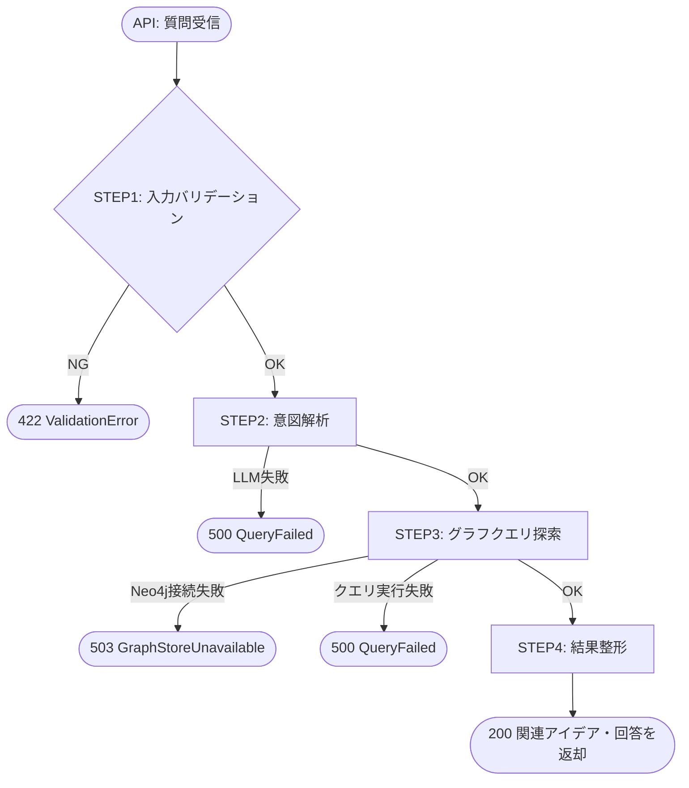

# Idea Relation Retrieverノード

## Overview

Idea Relation Retriever は、自然言語で入力された質問から、ナレッジグラフ（Neo4j）に保存された
アイデア・概念の関係性を検索し、回答を生成して返す Gatherer ノード。

- 入力: `question`（自然言語）+ オプションフィルタ（`domain`, `max_results`, `user_id`）
- 処理: 入力バリデーション → LLM による意図解析 → グラフクエリ探索 → 結果整形
- 出力: 関連アイデアのリスト + LLM が生成した回答文

責務:
- 質問の理解（意図・キーワードの抽出）
- ナレッジグラフへのクエリ実行
- 回答の生成
- 結果の整形

## Scope

- **対象**: 自然言語質問 → グラフ検索 → 回答生成
- **非対象**: Neo4j へのデータ書き込み（Persister の責務）
- **順序制約**: idea-relation-persister によってデータが保存済みであることを前提とする

## 状態遷移



### エラーパスの補足

| エラー種別 | 発生ステップ | HTTP ステータス | 例外クラス |
|---|---|---|---|
| 入力不正（空文字、範囲外） | STEP1 | 422 | `IdeaRelationRetrieverValidationError` |
| LLM 応答失敗・タイムアウト | STEP2 | 500 | `QueryFailed` |
| Neo4j 接続不可 | STEP3 | 503 | `GraphStoreUnavailable` |
| クエリ実行例外 | STEP3 | 500 | `QueryFailed` |

## STEP 詳細

### STEP1: 入力バリデーション

**担当**: `validation.py`

- 必須項目の存在と型を検証
- `question`: 非空・空白のみ禁止
- `max_results`: 1以上100以下（デフォルト10）
- `domain`: 指定された場合は非空・空白のみ禁止

**成功時**: `ValidatedInput`（`IdeaRelationRetrieverInput` の型エイリアス）として次ステップへ渡す

### STEP2: 意図解析

**担当**: `interpret.py`

- LLM を使用して質問の意図を解析し、グラフ検索に適したクエリ文字列を生成する
- 入力テキストの精製・言い換え・キーワード抽出を行い、`retrieval_with_text()` への入力文字列を返す
- 例: "量子コンピュータと古典コンピュータの関係は？" → "量子コンピュータ 古典コンピュータ 比較 関係"
- LLM 呼び出し失敗時は `QueryFailed` を送出する

> `concept_identification` は独立ステップにしない。`retrieval_with_text()` が内部で
> vector + synonym 検索を行うため、キーワード列挙の外出しは不要。
> interpret.py がクエリ文字列の精製のみを担う。

### STEP3: グラフクエリ探索

**担当**: `query_exploration.py`

- `Neo4jGraphStoreManager.retrieval_with_text()` の薄いラッパー
- STEP2 で得たクエリ文字列を `query_text` として渡す
- `max_results` を `similarity_top_k` に反映
- 返却されたクエリエンジン結果を次ステップに渡す
- Neo4j 接続不可時は `GraphStoreUnavailable`、実行時例外は `QueryFailed` を送出

```python
# 利用するインターフェース（graph_store.py）
manager.retrieval_with_text(
    query_text=interpreted_query,
    llm=llm,
    max_results=input.max_results,
    sub_retrievers=["vector", "synonym"],
)
```

### STEP4: 結果整形

**担当**: `express.py`

- クエリエンジン結果を `IdeaRelationRetrieverOutput` に整形して返却
- `answer`: クエリエンジンが生成した回答文
- `related_ideas`: 関連ノードを `RelatedIdea` のリストに変換
- `elapsed_ms`: 処理時間を付与
- 関連ノードが0件の場合も空リストとして正常返却する（エラーにしない）
- ノード変換の失敗は best-effort で `warnings` に記録して継続する

## モジュール構成

### ファイル構成と責務

```
idea_relation_retriever/
├── __init__.py            # 公開インターフェース（IdeaRelationRetrieverPipeline 等）
├── types.py               # 入出力スキーマ・エラー型
├── pipeline.py            # STEP1〜4 のオーケストレーション
├── validation.py          # STEP1: 入力バリデーション
├── interpret.py           # STEP2: LLM 意図解析
├── query_exploration.py   # STEP3: グラフクエリ探索
└── express.py             # STEP4: 結果整形・出力
```

### STEP と担当モジュールの対応

| STEP | 内容 | 担当モジュール |
|---|---|---|
| STEP1 | 入力バリデーション | `validation.py` |
| STEP2 | LLM 意図解析 | `interpret.py` |
| STEP3 | グラフクエリ探索 | `query_exploration.py` |
| STEP4 | 結果整形 | `express.py` |
| オーケストレーション | STEP1→4 の順次実行 | `pipeline.py` |
| HTTP エラーマッピング | 型付き例外 → HTTP ステータス変換 | `api/v1/ideas.py`（ルーター直接） |

### 依存モジュール

| モジュール | 役割 |
|---|---|
| `infra/graph_store.py` | `Neo4jGraphStoreManager`（`retrieval_with_text` 提供） |
| `idea_relation_persister/types.py` | `GraphStoreUnavailable`（既存エラー型を再利用） |

### 新設対象

| モジュール | クラス/関数 | 役割 |
|---|---|---|
| `idea_relation_retriever/__init__.py` | `IdeaRelationRetrieverPipeline`, `IdeaRelationRetrieverInput`, `IdeaRelationRetrieverOutput` | 公開インターフェース |
| `idea_relation_retriever/types.py` | `IdeaRelationRetrieverInput`, `RelatedIdea`, `IdeaRelationRetrieverOutput`, `IdeaRelationRetrieverValidationError`, `QueryFailed` | 入出力・エラー型定義 |
| `idea_relation_retriever/pipeline.py` | `IdeaRelationRetrieverPipeline.run()` | STEP1〜4 のオーケストレーション |
| `idea_relation_retriever/validation.py` | `validate()` | STEP1: 入力バリデーション |
| `idea_relation_retriever/interpret.py` | `interpret()` | STEP2: LLM 意図解析 |
| `idea_relation_retriever/query_exploration.py` | `explore()` | STEP3: グラフクエリ探索 |
| `idea_relation_retriever/express.py` | `express()` | STEP4: 結果整形 |
| `api/v1/ideas.py` | `POST /v1/ideas/relations/search` | HTTP エラーマッピング付きルーター（既存ファイルに追加） |

### 型定義（`types.py`）

```python
class IdeaRelationRetrieverInput(BaseModel):
    question: str
    max_results: int = Field(default=10, ge=1, le=100)
    domain: str | None = None
    user_id: str | None = None


class RelatedIdea(BaseModel):
    node_id: str
    title: str
    body_snippet: str
    relevance_score: float = Field(ge=0.0, le=1.0)


class IdeaRelationRetrieverOutput(BaseModel):
    question: str
    answer: str
    related_ideas: list[RelatedIdea]
    elapsed_ms: int
    warnings: list[str] = Field(default_factory=list)


ValidatedInput = IdeaRelationRetrieverInput  # 型エイリアス（再構築なし）


class IdeaRelationRetrieverValidationError(ValueError):
    def __init__(self, field: str, reason: str) -> None:
        self.field = field
        self.reason = reason
        super().__init__(f"[validation] field={field} reason={reason}")


class QueryFailed(Exception):
    """LLM 失敗またはグラフクエリ実行失敗"""
```

## API Input / Output 定義

### POST `/v1/ideas/relations/search`

既存の `api/v1/ideas.py` ルーターに追加する。

#### Request (`IdeaRelationRetrieverInput`)

| フィールド | 型 | 必須 | 説明 |
|---|---|:---:|---|
| `question` | `str` | ✅ | 自然言語の質問文 |
| `max_results` | `int` | ➖ | 返す関連アイデアの最大数（デフォルト10、1〜100） |
| `domain` | `str \| null` | ➖ | 検索対象ドメインのフィルタ（例: "コンピュータサイエンス"） |
| `user_id` | `str \| null` | ➖ | 質問者の識別子（ログ用、出力には含まれない） |

#### Response (`IdeaRelationRetrieverOutput`)

| フィールド | 型 | 説明 |
|---|---|---|
| `question` | `str` | 入力された質問文 |
| `answer` | `str` | LLM が生成した回答文 |
| `related_ideas` | `list[RelatedIdea]` | 関連アイデアのリスト（0件の場合は空リスト） |
| `elapsed_ms` | `int` | 処理時間（ms） |
| `warnings` | `list[str]` | 軽微な警告（best-effort 処理の失敗など） |

`RelatedIdea` の各フィールド:

| フィールド | 型 | 説明 |
|---|---|---|
| `node_id` | `str` | Neo4j ノード ID |
| `title` | `str` | アイデアのタイトル |
| `body_snippet` | `str` | 本文の抜粋 |
| `relevance_score` | `float` | 関連度スコア（0.0〜1.0） |

## バリデーションルール

| 条件 | ルール | エラー |
|---|---|---|
| `question` | 非空、空白のみ禁止 | `ValidationError(question)` → 422 |
| `max_results` | `1 <= x <= 100` | `ValidationError(max_results)` → 422 |
| `domain` | 指定時は非空・空白のみ禁止 | `ValidationError(domain)` → 422 |
| LLM 応答失敗 | タイムアウト / パース失敗 | `QueryFailed` → 500 |
| Neo4j 接続不可 | GraphStore 未接続 | `GraphStoreUnavailable` → 503 |
| グラフクエリ実行例外 | `retrieval_with_text` 例外 | `QueryFailed` → 500 |

## 正常系 / 異常系テスト設計

## 配置方針（ミラー）

- 実装: `backend/src/origin_spyglass/idea_relation_retriever/`
- テスト: `backend/tests/idea_relation_retriever/`

### テストファイル対応

| テストファイル | 対象モジュール |
|---|---|
| `_helpers.py` | 共通テストデータファクトリ |
| `test_validation.py` | `validation.py` |
| `test_interpret.py` | `interpret.py` |
| `test_query_exploration.py` | `query_exploration.py` |
| `test_express.py` | `express.py` |
| `test_pipeline.py` | `pipeline.py` |
| `tests/api/v1/test_ideas.py` | `api/v1/ideas.py` |

### 正常系

1. **通常の質問**: 質問に対して関連アイデアリストと回答文が返される
2. **domain フィルタ適用**: `domain` 指定時にクエリに反映される
3. **max_results 反映**: `max_results=5` が `retrieval_with_text(max_results=5)` に渡される
4. **関連0件**: グラフに関連ノードが存在しない場合、`related_ideas=[]` で正常返却（エラーにならない）
5. **user_id 受け付け**: `user_id` 指定時にバリデーション通過し、ログに記録される（出力には含まれない）

### バリデーション異常系

6. **question 空文字**: `question=""` → 422
7. **question 空白のみ**: `question="   "` → 422
8. **max_results=0**: 下限違反 → 422
9. **max_results=101**: 上限超過 → 422
10. **domain 空白のみ**: `domain="  "` → 422

### 外部依存障害

11. **LLM タイムアウト**: interpret ステップで LLM 失敗 → 500 QueryFailed
12. **Neo4j 接続不可**: query_exploration ステップで接続失敗 → 503 GraphStoreUnavailable
13. **クエリ実行例外**: `retrieval_with_text` が例外送出 → 500 QueryFailed
14. **クエリ結果0件（正常）**: Neo4j 接続可・ヒットなし → 正常（空リスト返却）

### パイプライン統合テスト

15. **実行順序**: `validate → interpret → query_exploration → express` の順で呼ばれること
16. **interpret 失敗で停止**: interpret でエラーが発生した場合に後続ステップが呼ばれないこと
17. **query_exploration 失敗で停止**: query_exploration でエラーが発生した場合にパイプラインが停止すること

### API テスト

18. **POST 正常**: `POST /v1/ideas/relations/search` → 200 + `IdeaRelationRetrieverOutput` スキーマ確認
19. **POST バリデーション**: `question=""` → 422
20. **POST GraphStore 障害**: Neo4j 接続失敗 → 503

### `_helpers.py` ファクトリ関数

```python
def make_valid_input(**overrides: object) -> IdeaRelationRetrieverInput:
    defaults = {
        "question": "量子コンピュータと古典コンピュータの関係は？",
        "max_results": 10,
        "domain": None,
        "user_id": None,
    }
    defaults.update(overrides)
    return IdeaRelationRetrieverInput(**defaults)


def make_related_idea(**overrides: object) -> RelatedIdea:
    defaults = {
        "node_id": "node-001",
        "title": "量子コンピュータ",
        "body_snippet": "量子コンピュータは量子力学の原理を...",
        "relevance_score": 0.92,
    }
    defaults.update(overrides)
    return RelatedIdea(**defaults)


def make_valid_output(**overrides: object) -> IdeaRelationRetrieverOutput:
    defaults = {
        "question": "量子コンピュータと古典コンピュータの関係は？",
        "answer": "量子コンピュータは古典コンピュータとは異なる計算原理を持ち...",
        "related_ideas": [make_related_idea()],
        "elapsed_ms": 120,
        "warnings": [],
    }
    defaults.update(overrides)
    return IdeaRelationRetrieverOutput(**defaults)
```

## Acceptance Criteria

- 自然言語の質問を入力として受け取り、Neo4j から関連アイデアを検索して返せる
- `max_results` と `domain` フィルタが検索に反映される
- LLM による意図解析結果がクエリ文字列として `retrieval_with_text()` に渡される
- 関連0件でも正常返却し、エラーにしない
- 入力不正・外部依存障害を原因別にエラー返却できる
- `backend/src` と `backend/tests` のミラー構成でテストが揃う
- 既存の `api/v1/ideas.py` に `POST /v1/ideas/relations/search` エンドポイントとして追加される
