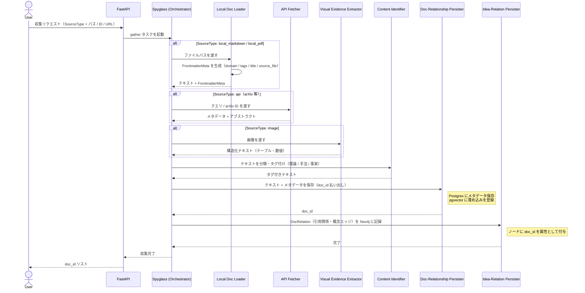
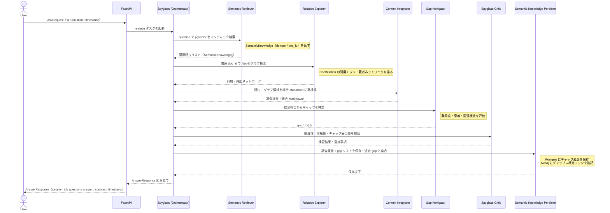

# Overview
- ORIGIN-Spyglass のユーザージャーニーは、**Knowledge Gathering フェーズ**（知識の収集・蓄積）と **Knowledge Retrieval フェーズ**（知識の取得・合成）に分かれる
- 各フェーズで Spyglass グラフがどの Node を呼ぶかを追える構成にする
- Node の定義と層構造は [architecture.md](architecture.md) を参照

---

## Terms

| 用語 | 概要 | 実装参照 |
| :--- | :--- | :--- |
| `domain` | 検索・保存の論理的な名前空間。将来的に PostgreSQL のマスタテーブルで管理する。Neo4j 上では `:Domain` ノードに対応する | `DocRelation.domain` / `SemanticKnowledge.domain` |
| `doc_id` | Doc-Relationship Persister が払い出す文書の一意識別子。Idea-Relation Persister・Semantic Knowledge Persister が参照する共通キー | `DocumentMetadata.doc_id` |
| `SourceType` | 文書の取得元種別。`local_markdown` / `local_pdf` / `web` / `api` / `image` の 5 種を定義 | `DocRelation.SourceType` — `origin_spyglass/schemas/doc_relation.py` |
| `DocRelation` | ドキュメント間の引用関係を表すスキーマ。Neo4j グラフ上の edge とそのプロパティに対応。`tags`・`author`・`source_type`・`confidence`・`date`・`domain` を持つ | `origin_spyglass/schemas/doc_relation.py` |
| `SemanticKnowledge` | 意味ベースの関連付けがなされた知識単位。`domain` と `doc_id` を持ち、断片同士が意味的に結びつく | `origin_spyglass/schemas/semantic_knowledge.py` |
| `FrontmatterMeta` | Markdown Frontmatter のメタデータスキーマ。`domain`・`tags`・`title`・`created_at`・`source_file` を持つ。Local Doc Loader がパース時に生成する | `origin_spyglass/local_doc_loader/types.py` |
| `AskRequest` | ユーザーの質問を受け取るリクエストスキーマ。`id`・`question`・`timestamp` を持つ | `origin_spyglass/schemas/ask.py` |
| `AnswerResponse` | 調査結果を返すレスポンススキーマ。`session_id`・`question`・`answer`・`sources`・`timestamp` を持つ。`sources` は `SourceItem`（title / content / link）のリスト | `origin_spyglass/schemas/ask.py` |
| `gap` | 調査によって特定された未解決問題。難易度・意義・関連概念を属性に持つ（スキーマは未実装、設計中） | 未実装 |

---

## Phase 1: Knowledge Gathering（知識の収集・蓄積）

> **目的**: 外部ソースから情報を取り込み、Postgres / Neo4j に蓄積する。
> **トリガー**: ユーザーがファイル・URL・arXiv ID を指定して収集リクエストを送る。

### ステップ詳細

1. **リクエスト受付**
   - ユーザーは `SourceType`（`local_markdown` / `local_pdf` / `web` / `api` / `image`）と対象を指定する
   - WebUI / MCP 経由で FastAPI に送信

2. **テキスト化**（Gatherer 層）
   - **Local Doc Loader**: `local_markdown` / `local_pdf` をパース・OCR し、`FrontmatterMeta`（domain / tags / title / source_file）を生成
   - **API Fetcher**: arXiv 等の外部 API からメタデータ・アブストラクトを取得（`SourceType.api`）
   - **Visual Evidence Extractor**: `SourceType.image`（図表・グラフ画像）をテキスト・構造化データに変換

3. **分類・タグ付け**（Content Identifier）
   - 取得テキストを「理論」「手法」「事実」等に分類し、`DocRelation.tags` に相当するタグを付与

4. **文書保存**（[Doc-Relationship Persister](architecture.md#doc-relationship-persister文書と紐付け)）
   - `DocRelation`（tags / author / source_type / confidence / date / domain）を Postgres に保存し `doc_id` を払い出す
   - 埋め込みを pgvector にインデックス登録（Semantic Retriever が参照）

5. **関係記録**（[Idea-Relation Persister](architecture.md#idea-relation-persister概念関係の記録)）
   - 引用関係・共起概念・著者ネットワークを Neo4j に書き込む
   - ノードに `doc_id` を属性として付与し、グラフから元文書を逆引きできるようにする

---

## Phase 2: Knowledge Retrieval（知識の取得・合成）

> **目的**: 蓄積済みの知識を横断検索・統合し、ギャップを特定して調査報告を生成する。
> **トリガー**: ユーザーが `AskRequest`（question + session_id）を送る。

### ステップ詳細

1. **リクエスト受付**
   - ユーザーは `AskRequest`（`id` / `question` / `timestamp`）を FastAPI に送る
   - `session_id` でセッションをまたいだ追跡が可能

2. **セマンティック検索**（Semantic Retriever）
   - pgvector で question に近い `SemanticKnowledge`（`domain` / `doc_id`）を取得
   - Neo4j 側でも意味的に関連するノードを補完検索

3. **グラフ探索**（Relation Explorer）
   - 取得した `doc_id` をキーに Neo4j で `DocRelation` の引用エッジ・著者ネットワーク・共起概念を辿る
   - `DocRelation.confidence` でエッジの信頼度を考慮した絞り込みを行う

4. **統合**（Context Integrator）
   - ベクトル検索結果とグラフ探索結果を一貫した調査報告 Markdown に再構成
   - `AnswerResponse.sources`（title / content / link）の元データを生成

5. **ギャップ特定**（Gap Navigator）
   - 統合報告を俯瞰して未解決問題（gap）を抽出
   - 各 gap に難易度・意義・関連概念ノードを紐付ける

6. **批評**（Spyglass Critic）
   - 網羅性・エビデンス信頼性（`DocRelation.confidence` 等）・ギャップ妥当性を検証
   - 不備・バイアスを指摘し、必要なら Retrieval ステップを再実行させる

7. **結果保存**（[Semantic Knowledge Persister](architecture.md#semantic-knowledge-persister調査結果の蓄積)）
   - 調査報告と gap リストを Postgres に保存
   - 過去の gap レコードと突合してステータスを更新
   - Neo4j に gap ↔ 概念ノードのエッジを追記（[Idea-Relation Persister](architecture.md#idea-relation-persister概念関係の記録) 登録済みのノードへ）

8. **レスポンス返却**
   - `AnswerResponse`（`session_id` / `question` / `answer` / `sources` / `timestamp`）を組み立てて返す

---

## Persister の呼び出しタイミング早見表

| Persister | フェーズ | トリガーとなる Node | 保存先 | 払い出す / 参照するキー |
| :--- | :--- | :--- | :--- | :--- |
| [Doc-Relationship Persister](architecture.md#doc-relationship-persister文書と紐付け) | Gathering | Local Doc Loader / API Fetcher / Visual Evidence Extractor | Postgres + pgvector | `doc_id` を払い出す |
| [Idea-Relation Persister](architecture.md#idea-relation-persister概念関係の記録) | Gathering | Relation Explorer / Content Identifier | Neo4j | `doc_id` を参照（属性として付与） |
| [Semantic Knowledge Persister](architecture.md#semantic-knowledge-persister調査結果の蓄積) | Retrieval | Gap Navigator（Critic 検証後） | Postgres + Neo4j | `doc_id`・概念ノード ID を参照 |

> **実行順序の制約**: `doc_id` が存在しないと Idea-Relation Persister・Semantic Knowledge Persister が整合性を保てない。Spyglass は Persister を **Doc → Rel → Res** の順に固定して呼ぶ。詳細は [architecture.md — Persister 詳細](architecture.md#persister-詳細) を参照。
